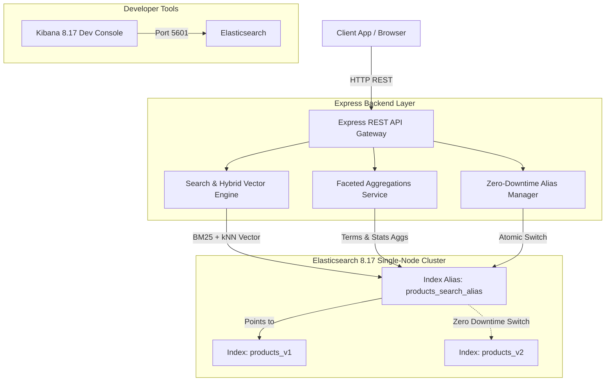

# 🚀 OmniSearch Hub: Enterprise Hybrid Search Engine & E-Commerce Intelligence Platform

OmniSearch Hub is a production-grade, high-performance search infrastructure designed to showcase advanced Elasticsearch 8.x capability within Node.js. It features **Hybrid Search (BM25 Keyword + Dense Vector kNN Embeddings)**, **Instant Edge N-Gram Autocomplete**, **Faceted Aggregations**, **Zero-Downtime Alias Reindexing**, and a **Real-Time Query DSL Inspector Web Dashboard**.

---

## 🏗️ System Architecture

---

## 📋 Implementation Phases

### Phase 1: Core Foundation & Index Architecture
- [x] Docker Compose setup (`Elasticsearch 8.17` + `Kibana 8.17`).
- [ ] Production Index Schema Mapping:
  - Custom `edge_ngram` analyzer for prefix instant autocomplete (`title.autocomplete`).
  - `dense_vector` mapping for 384-dimensional semantic embeddings.
  - Multi-fields (`title`, `title.keyword`, `title.autocomplete`).
  - Index Aliases (`products_search_alias` &rarr; `products_v1`).

### Phase 2: Production Seeding & Vector Generation Pipeline
- [ ] Bulk API ingestion pipeline (`esClient.bulk`).
- [ ] Realistic e-commerce dataset (Laptops, Smartphones, Audio, Gaming, Accessories).
- [ ] Vector embedding generation for hybrid semantic search.

### Phase 3: Enterprise Search & Analytics Engine
- [ ] **Hybrid Search Engine**: Combines BM25 keyword relevance with Dense Vector kNN matching (`knn` + `bool`).
- [ ] **Typo-Tolerant Multi-Match**: Field boosting (`title^3`, `brand^2`, `description`).
- [ ] **Faceted Aggregations**: Category buckets, Brand counts, Price statistics (min, max, avg), Price range tiers.
- [ ] **Zero-Downtime Reindexing**: Atomic index migration API (`products_v1` &rarr; `products_v2`).

### Phase 4: REST API Gateway
- [ ] `GET /api/v1/search` &mdash; Hybrid search with filtering & highlighting.
- [ ] `GET /api/v1/autocomplete` &mdash; Instant sub-millisecond prefix suggestions.
- [ ] `GET /api/v1/analytics` &mdash; Aggregate metrics & faceted breakdowns.
- [ ] `POST /api/v1/admin/reindex` &mdash; Zero-downtime alias swap endpoint.
- [ ] `GET /api/v1/health` &mdash; Cluster health & shard metrics.

### Phase 5: State-of-the-Art Web UI Dashboard
- [ ] Glassmorphic Dark-Mode UI with smooth animations.
- [ ] Search mode toggle: **BM25 Keyword Search** vs **Hybrid Semantic (Vector + BM25)**.
- [ ] Live Autocomplete dropdown with keyboard navigation.
- [ ] Faceted sidebar (Categories, Brands, Price Slider, Stock status).
- [ ] **Live Query DSL Inspector**: Real-time view of the exact JSON payload sent to Elasticsearch.
- [ ] **Analytics Tab**: Visual stats cards & price distribution histograms.

### Phase 6: GitHub Portfolio Documentation
- [ ] Professional `README.md` with system architecture diagrams, API docs, Kibana console cheat sheet, and performance specs.

---

## 🛠️ Tech Stack

* **Core Search Engine**: Elasticsearch 8.17.0
* **Visual Console & Management**: Kibana 8.17.0
* **Backend Runtime**: Node.js (ES Modules, Express 4.x)
* **SDK**: `@elastic/elasticsearch` 8.x
* **Containerization**: Docker & Docker Compose
* **Frontend**: Modern Vanilla HTML5 / CSS3 (Glassmorphism design system) & JavaScript ES6+
