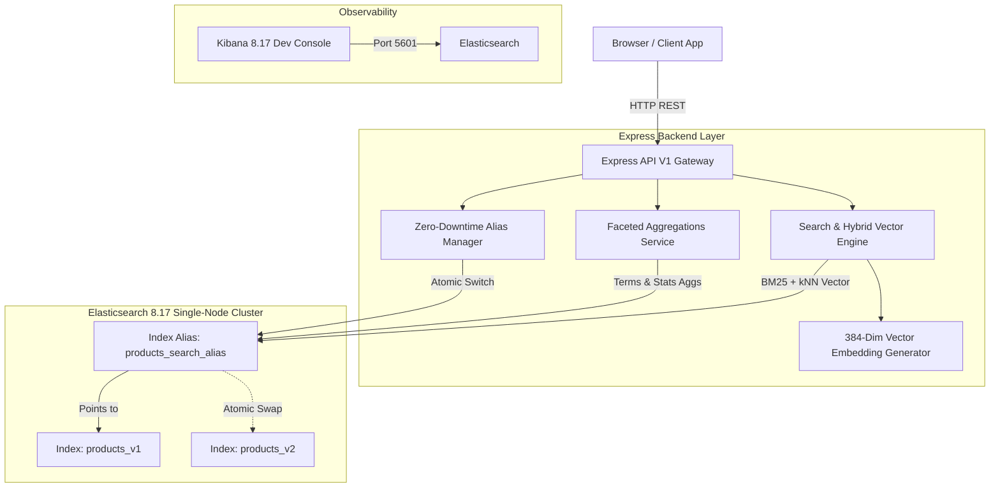

# 🚀 OmniSearch Hub

> A hands-on project built for **practicing and mastering Elasticsearch 8.x** with Node.js. It features a complete **Hybrid Search Engine & E-Commerce Intelligence Platform** using **Dense Vector Embeddings**, **Kibana**, and **Express**.

---

## 🌟 Key Features

* 🧠 **Hybrid Search Engine**: Combines classic BM25 keyword relevance with **384-dimensional Dense Vector kNN Embeddings** (`cosine` similarity) for true semantic search.
* ⚡ **Sub-Millisecond Instant Autocomplete**: Powered by a custom `edge_ngram` index analyzer that indexes prefix tokens as you type.
* 🔄 **Zero-Downtime Alias Reindexing**: Demonstrates atomic index migrations (`products_v1` &rarr; `products_v2`) using Elasticsearch **Index Aliases** (`updateAliases`) with 0ms downtime.
* 📊 **Faceted Navigation & Analytics**: Real-time bucket aggregations (categories, brands) and metric aggregations (min/max/avg price statistics).
* 🎯 **Typo-Tolerant Multi-Match**: Field-weighted relevance boosting (`title^3`, `brand^2`, `description`) with fuzzy matching (`fuzziness: AUTO`).
* 🔍 **Live Query DSL Inspector**: Interactive UI dashboard featuring a real-time JSON inspector displaying exact raw Elasticsearch payloads.

---

## 🏗️ Architecture



---

## 📁 Repository Structure

```
.
├── docker-compose.yml           # Elasticsearch 8.17.0 & Kibana 8.17.0 cluster
├── PROJECT_PLAN.md              # System design blueprint & implementation phases
├── README.md                    # Project documentation & GitHub showcase
├── package.json                 # Node.js dependencies & scripts
├── public/                      # Glassmorphic Web UI Dashboard
│   ├── css/style.css            # Dark mode glassmorphic styling
│   ├── js/app.js                # Reactive dashboard frontend logic
│   └── index.html               # Main dashboard HTML template
└── src/
    ├── client.js                # Elasticsearch Client SDK instance
    ├── server.js                # Express app entry point
    ├── config/
    │   └── index-settings.js    # Index schema, edge_ngram analyzer & dense_vector mapping
    ├── routes/
    │   └── api.routes.js        # Express API V1 routes
    ├── scripts/
    │   └── seed.js              # Standalone CLI seeder runner
    └── services/
        ├── index.service.js     # Zero-downtime alias & reindexing manager
        ├── search.service.js    # Hybrid BM25 + kNN search & autocomplete engine
        ├── seeder.service.js    # Catalog seeder with dense vector embeddings
        └── vector.service.js    # 384-dimensional vector embedding generator
```

---

## 🚀 Quick Start

### 1. Prerequisites
- [Docker & Docker Compose](https://www.docker.com/)
- [Node.js v18+](https://nodejs.org/)

### 2. Spin Up Elasticsearch & Kibana
```bash
docker compose up -d
```
*Wait ~30 seconds for Elasticsearch (`http://localhost:9200`) and Kibana (`http://localhost:5601`) to initialize.*

### 3. Install Dependencies & Seed Catalog
```bash
npm install
npm run seed
```

### 4. Launch the Application
```bash
npm run dev
```
Open **[http://localhost:3001](http://localhost:3001)** in your browser!

---

## 🔌 API Reference

| Endpoint | Method | Description |
| :--- | :--- | :--- |
| `GET /api/v1/search` | `GET` | Executes Hybrid BM25 + kNN vector search with filtering & aggregations. |
| `GET /api/v1/autocomplete` | `GET` | Sub-millisecond prefix autocomplete recommendations. |
| `POST /api/v1/admin/reindex` | `POST` | Triggers zero-downtime alias migration (`products_v1` &rarr; `products_v2`). |
| `POST /api/v1/admin/seed` | `POST` | Seeds/re-seeds the product catalog with dense vector embeddings. |
| `GET /api/v1/health` | `GET` | Returns Elasticsearch cluster status & active alias backing index. |

---

## 🛠️ Kibana Dev Tools Snippets

Access Kibana Console at **`http://localhost:5601/app/dev_tools#/console`**.

### 1. View Active Index Alias Mapping
```http
GET products_search_alias/_mapping
```

### 2. Test Custom Edge N-Gram Autocomplete Analyzer
```http
POST products_search_alias/_analyze
{
  "analyzer": "autocomplete_index",
  "text": "MacBook"
}
```

### 3. Run Hybrid kNN Vector + BM25 Query
```http
GET products_search_alias/_search
{
  "query": {
    "bool": {
      "must": [
        { "multi_match": { "query": "wireless headphones", "fields": ["title^3", "description"] } }
      ]
    }
  },
  "knn": {
    "field": "vector_embedding",
    "query_vector": [0.05, 0.12, -0.08, ...],
    "k": 5,
    "num_candidates": 20,
    "boost": 0.5
  }
}
```

---

## 📜 License
MIT License. Free to use and customize for portfolio or production applications.
